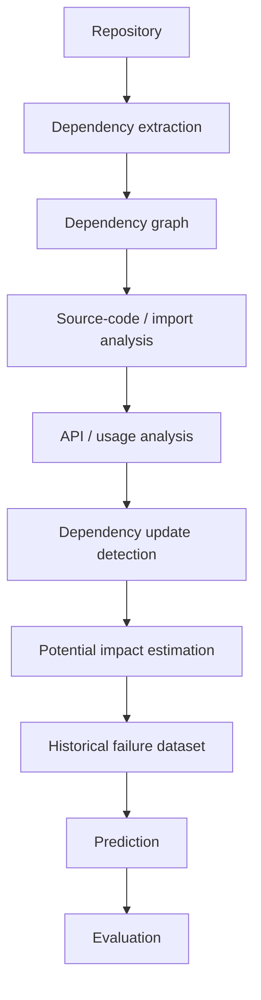
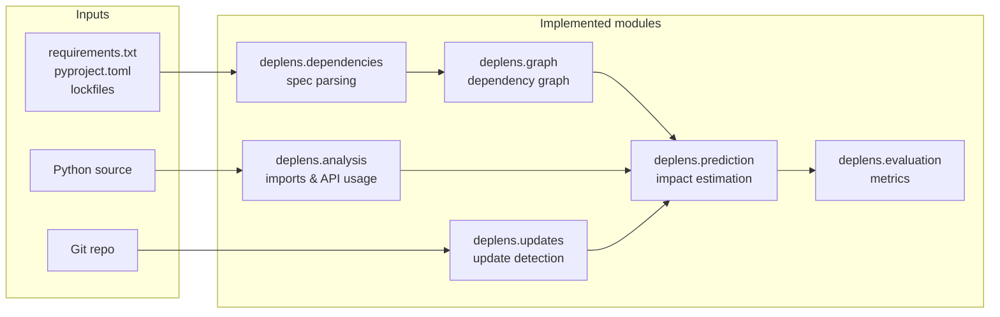

# DepLens

> Investigating whether dependency graphs, code usage, and historical evidence can predict the impact of dependency updates before they are applied.

**Status: working research prototype (v0).** The pipeline runs end to end — parsing,
graphing, usage tracing, update mining, heuristic and test-grounded labeling, baselines,
evaluation — against real repositories. What it has *not* done is answer the research
question: every measurement so far is pipeline validation on tiny, weak data, not evidence
of predictive power. This README marks each claim accordingly.

## 1. Problem Statement

Modern Python projects depend on large, transitive dependency networks. Updating a single dependency — even a patch release — can break downstream code through removed APIs, changed behavior, altered transitive constraints, or build/test failures.

Current practice is largely reactive: apply the update (e.g., via Dependabot / Renovate), run CI, and fix failures after the fact. There is no widely validated, evidence-based method for estimating *before the update* which parts of a repository are likely to break and why.

DepLens treats this as an open research question, not a solved engineering problem.

## 2. What Works Today vs What Does Not

Implemented and tested (91 tests, `ruff check` clean, CI runs both):

| Area | Status | Entry points |
|---|---|---|
| Spec parsing (`requirements.txt`, `pyproject.toml` incl. Poetry, `poetry`/`uv`/`Pipfile` locks) | `implemented` | `deplens.dependencies` |
| Dependency graph (direct/transitive, depth, dependents, centrality, snapshots) | `implemented` | `deplens.graph` |
| AST import parsing, import→dependency linking, qualified API-usage tracing | `implemented` | `deplens.analysis` |
| Git-history update detection (deduplicated, marker/extras-sensitive) | `implemented` | `deplens.updates.detection` |
| Heuristic labels (`reverted` / `fix-suspect` / `no-signal`) | `implemented` | `deplens.updates.labeling` |
| Worktree test-outcome labels incl. isolated venvs, era installs, `uv sync --locked` | `implemented` | `deplens.updates.test_outcomes` |
| Baselines (major-version, direct, API-change, depth, code-usage), hybrid model, LLM seam | `implemented` | `deplens.prediction` |
| Impact reports (affected files/APIs, rule verdicts, risk score) | `implemented` | `deplens impact` |
| Metrics (precision/recall/F1/FP/FN, ROC-AUC, Brier), per-rule scoring, ablation, temporal splits, strata | `implemented` | `deplens.evaluation` |
| CLI (`analyze`, `impact`, `predict`, `updates`), JSON + markdown reports, GitHub workflow + PR comments | `implemented` | `deplens.cli` |

Not done / explicitly future:

- **Any validated prediction claim.** Nothing here is shown to predict real breakage.
- Live transitive resolution from package metadata; version-range feature coercion.
- Scope/shadowing-precise usage analysis; relative and star imports.
- A curated, large-scale labeled dataset (`datasets/v0` has 42 cases, 1 weak positive).
- Classical ML / embeddings / an evaluated LLM backend (the seam exists, the backends don't).
- Proof the tooling helps developers (Phase 7 usefulness is undemonstrated).

## 3. Quickstart

Requires Python 3.10+ and `uv` (or `pip`).

```bash
git clone <this-repo> && cd deplens
uv sync  # or: pip install -e .

# Project analysis (JSON default, --format markdown available)
uv run deplens analyze /path/to/project

# Impact report for one update in a project (files, APIs, verdicts, risk)
uv run deplens impact /path/to/project --package requests --old "==2.28.0" --new "==2.31.0"

# Score one hypothetical update from raw signals
uv run deplens predict --package requests --old 1.0.0 --new 2.0.0 --affected-imports 3

# Labeled dependency-update history of a git checkout
uv run deplens updates /path/to/git-repo

# Tests, lint, and the committed v0 experiment
uv run --with pytest pytest -q
uv run --with ruff ruff check src tests scripts
uv run python experiments/reproduce_v0.py
```

`updates` needs a git checkout (it shells out to `git log`/`git show`); `analyze` works on
any directory and reports unparsable files under `parse_errors` instead of crashing.

## 4. Reproducing the Reported Results

The v0 dataset (`datasets/v0/cases.jsonl`, 42 cases — 40 weak-label, 2 test-grounded;
provenance and limits in `datasets/v0/README.md`) and its reproduction script are committed:

```bash
uv run python experiments/reproduce_v0.py --out /tmp/v0-check
diff /tmp/v0-check/metrics.json experiments/results/v0/metrics.json && echo REPRODUCED
```

Expected output (also committed at `experiments/results/v0/`):

| Rule | Precision | Recall | F1 | FP rate | FN rate | ROC-AUC | Brier |
| --- | --- | --- | --- | --- | --- | --- | --- |
| api-change | 0.00 | 0.00 | 0.00 | 0.00 | 1.00 | 0.17 | 0.02 |
| code-usage | 0.04 | 1.00 | 0.07 | 0.61 | 0.00 | 0.46 | 0.60 |
| dependency-depth | 0.17 | 1.00 | 0.29 | 0.12 | 0.00 | 0.88 | 0.12 |
| direct-dependency | 0.00 | 0.00 | 0.00 | 0.88 | 1.00 | 0.00 | 0.88 |
| major-version | 0.00 | 0.00 | 0.00 | 0.05 | 1.00 | 0.17 | 0.07 |

Ablation delta F1 (usage minus metadata): -0.21. n=42 with a single weak positive, so
treat this as a regression test for the harness, not as findings. Ad-hoc mining runs live
under `experiments/results/` but are git-ignored by convention; only `v0/` is versioned.

## 5. Architecture





Supporting pieces: `deplens/project.py` (whole-project analysis), `deplens/report.py`
(JSON/markdown reports, 0–100 risk scores), `deplens/cli.py` (entry point),
`scripts/` (experiment runners, PR comment poster), `experiments/` (reproducible runs).

## 6. Methodology, Assumptions, and Limitations

Protocol in full: [`docs/methodology.md`](docs/methodology.md). The non-negotiable rule:

> Given **only information available before the dependency update**, could we have predicted this failure?

Features are reconstructed at each update's parent commit (`git archive` / worktrees);
labels come from post-update evidence. What the current implementation assumes, and where
it is known to fall short:

- **Assumes spec files describe reality.** Dev-only, docs-only, and undeclared dependencies are invisible or noisy by construction.
- **Affected sets are over-approximations.** DepLens traces what the repo *uses*, not what the new version *changed* — every API listed in an impact report is "potentially affected," never "known broken."
- **Weak labels are proxies.** `reverted` / `fix-suspect` / `no-signal` correlate with breakage at best; absence of a revert is not evidence of safety.
- **Era reproduction is partial.** Fresh venvs install era requirements, test extras, and `uv.lock` closures where available — but undeclared CI-only deps and floating transitive pins still break old suites (both observed and documented in past run notes). Such cases are excluded, not forced.
- **No leakage controls beyond parent-state reconstruction.** Temporal splits and strata exist in code; published results don't yet use them at scale.

## 7. Central Research Question

> **Can dependency graphs, code usage information, API relationships, and historical evidence be used to predict the impact of dependency updates before they are applied?**

DepLens does **not** assume breakage merely because of a major-version change, a known API
change, deep nesting, or an LLM's judgment. Each is an unevaluated signal until measured.

Sub-questions (see [`docs/research_questions.md`](docs/research_questions.md)): RQ1 (affected-code
identification), RQ2 (which signals predict breakage), RQ3 (pre-update predictability), RQ4
(metadata vs metadata+usage, tested by ablation), RQ5 (ML/LLM vs deterministic baselines).

Tentative hypotheses, explicitly unvalidated: H1 direct beats transitive assessability; H2
usage beats pure relationships; H3 removed/modified APIs break more; H4 hybrids beat
version heuristics; H5 LLMs help only if they beat baselines. Accept, reject, or refine on data.

## 8. Scope

Python only: `requirements.txt`, `pyproject.toml`, common lockfiles, imports, version
relationships, feasible API usage, Git history, update commits, test/build outcomes.
Out of scope: other ecosystems, dynamic analysis, autofixes, production monitoring.

## 9. Evaluation Strategy

Held-out historical cases, pre-update features only: precision, recall, F1, FP/FN rates,
ROC-AUC, Brier calibration; temporal splits; RQ4 ablations; RQ5 baseline-first comparisons;
per-stratum slices (direct/transitive, major/non-major). Baselines: major-version,
direct-dependency, API-change, dependency-depth, plus code-usage for ablations.

## 10. Current Status and Roadmap

Full breakdown: [`docs/roadmap.md`](docs/roadmap.md). Short version: Phases 0–2 engine,
update detection with heuristic and test-grounded labels, baselines, evaluation toolkit,
initial advanced methods, and initial tooling are built; large-scale labeled data, validated
claims, and any ML/LLM evaluation are not. Phase 7 (developer tooling) stays gated on
evidence that prediction is reliable enough to matter.

## 11. Contributing

Research-stage contributions welcome, especially dataset curation, baseline reproductions,
static-analysis improvements, and methodology critique. Open an issue first; keep PRs small
with reproduction steps; no new ML/LLM dependencies until Phase 4 baselines exist for them
to beat; update `methodology.md`/`roadmap.md` when changing protocol.

## 12. License

Apache License 2.0 — see [LICENSE](LICENSE). Dataset rows document their upstream
provenance in `datasets/v0/README.md`.

---

> DepLens is an investigation into dependency-change impact prediction. The objective is not to assume that reliable prediction is possible, but to determine how far it can be pushed using empirical evidence.
