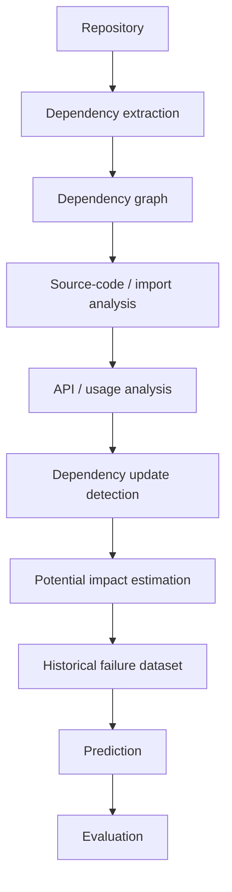
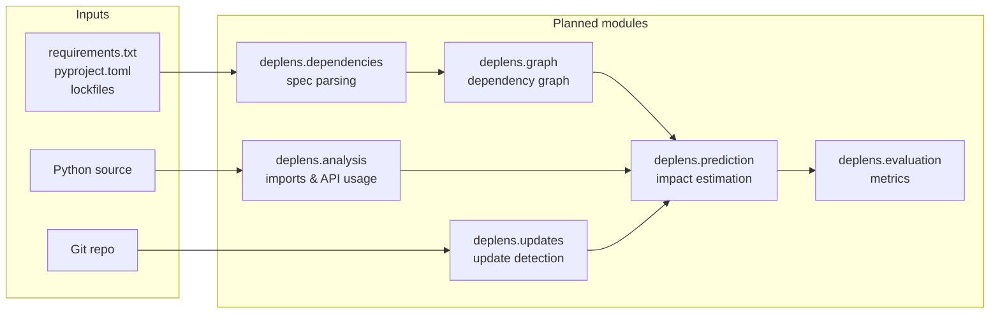

# DepLens

> Investigating whether dependency graphs, code usage, and historical evidence can predict the impact of dependency updates before they are applied.

## 1. Problem Statement

Modern Python projects depend on large, transitive dependency networks. Updating a single dependency — even a patch release — can break downstream code through removed APIs, changed behavior, altered transitive constraints, or build/test failures.

Current practice is largely reactive: apply the update (e.g., via Dependabot / Renovate), run CI, and fix failures after the fact. There is no widely validated, evidence-based method for estimating *before the update* which parts of a repository are likely to break and why.

DepLens treats this as an open research question, not a solved engineering problem.

## 2. Motivation

- Dependency updates are frequent, often automated, and noisy.
- Maintainers face alert fatigue from update PRs with unknown risk.
- Breakage is unevenly distributed: most updates are safe, a minority cause failures.
- Intuition-based heuristics (e.g., "major versions are dangerous") are uncalibrated and unevaluated.
- A reproducible, measured understanding of update-impact signals would benefit maintainers, tool authors, and researchers — **if** reliable prediction is possible.

The goal is empirical validation and reproducibility, not heuristics or marketing claims.

## 3. Central Research Question

> **Can dependency graphs, code usage information, API relationships, and historical evidence be used to predict the impact of dependency updates before they are applied?**

A critical constraint:

> Given **only information available before the dependency update**, could we have predicted this failure?

Post-hoc explanations do not count. A signal is only useful if it was observable pre-update and improves prediction on held-out historical cases.

### What DepLens does NOT assume

DepLens does **not** assume breakage merely because:

- a dependency has a major-version change,
- a dependency has a known API change,
- a dependency is deeply nested,
- an LLM judges the update as "looking dangerous."

These may be useful signals, but each must be empirically evaluated for precision, recall, and calibration.

## 4. Research Questions

### RQ1 — Affected-code identification

How accurately can dependency and code-usage information identify code that *may* be affected by a dependency update?

This covers mapping from a changed dependency → import sites → using modules/functions/classes.

### RQ2 — Predictive signals

Which signals are most predictive of actual downstream breakage?

Candidate signals (to be evaluated, not assumed):

- dependency depth
- direct vs. transitive dependency
- version distance
- semantic-version change type (major/minor/patch)
- removed / changed APIs
- number of affected imports
- affected functions / classes
- dependency centrality in the graph
- test coverage of affected code
- historical breakage frequency of the dependency
- maintainer / release activity
- number of downstream dependents

### RQ3 — Pre-update predictability

Can historical dependency-update failures be predicted *before* the update occurs?

This requires a dated historical dataset with strict temporal splits: features computed at parent commit, labels derived from post-update CI/test outcomes.

### RQ4 — Value of usage information

Does combining dependency metadata with source-code usage provide substantially better predictions than dependency metadata alone?

This is tested by ablation: metadata-only baseline vs. metadata + usage models.

### RQ5 — ML / LLM value-add

Can ML or LLM-based approaches improve upon deterministic / static-analysis baselines?

LLM-assisted API impact analysis is treated as an experimental method to be compared against deterministic baselines, not assumed superior.

See also [`docs/research_questions.md`](docs/research_questions.md).

## 5. Hypotheses

Explicitly marked as **hypotheses (unvalidated)**, not facts:

- **H1 (hypothetical):** Direct dependencies are generally easier to assess for update impact than deeply transitive dependencies.
- **H2 (hypothetical):** Actual API usage provides stronger predictive information than dependency relationships alone.
- **H3 (hypothetical):** Dependency updates involving removed or modified APIs are more likely to cause downstream failures.
- **H4 (hypothetical):** A hybrid model combining dependency metadata, source-code usage, and historical information will outperform simple version-based heuristics.
- **H5 (hypothetical):** LLM-assisted analysis may improve difficult API-level impact analysis, but should be evaluated against deterministic baselines rather than assumed to be superior.

Each hypothesis maps to one or more RQs and will be accepted, rejected, or refined based on measured results.

## 6. Proposed Methodology



Stages:

1. **Repository ingestion:** clone / sample Python repositories with history.
2. **Dependency extraction:** parse `requirements.txt`, `pyproject.toml`, lockfiles where practical, plus installed package metadata.
3. **Dependency graph:** build direct/transitive graph with version constraints. Status: `planned`.
4. **Source-code / import analysis:** parse Python source (AST), resolve imports to dependencies. Status: `planned`.
5. **API / usage analysis:** where feasible, map imports to functions/classes/APIs used. Status: `planned / experimental`.
6. **Dependency update detection:** identify update commits (e.g., Dependabot, manual bumps) via Git history. Status: `planned`.
7. **Potential impact estimation:** trace potentially affected code given a hypothetical update. Status: `planned`.
8. **Historical failure dataset:** label updates with post-update test/build outcomes as ground truth. Status: `planned`.
9. **Prediction:** apply baselines, then ML/LLM methods using only pre-update features. Status: `planned`.
10. **Evaluation:** report precision, recall, F1, FP/FN rates, calibration on held-out temporal splits. Status: `planned`.

Detailed protocol: [`docs/methodology.md`](docs/methodology.md).

## 7. Current Scope

Initial scope is intentionally narrow to avoid overengineering:

**Included:**

- Python repositories only (no multi-language support initially)
- Python package dependencies
- `requirements.txt`
- `pyproject.toml`
- lockfiles where practical (`poetry.lock`, `uv.lock`, `requirements*.lock`, `Pipfile.lock`)
- Python imports (`import`, `from ... import`)
- dependency / version relationships
- API / function / class usage where technically feasible
- Git history
- dependency update commits
- test / build failures associated with updates

**Explicitly out of scope for v0:**

- Non-Python ecosystems (npm, Cargo, Go modules, Maven)
- Dynamic analysis / runtime tracing
- Automated fixing / codemods
- Production deployment / monitoring

## 8. Project Architecture / Pipeline



Source layout (`src/deplens/`):

| Module | Purpose | Status |
|---|---|---|
| `dependencies/` | Parse requirements, pyproject, lockfiles | `planned` |
| `graph/` | Direct/transitive graph model, centrality, depth | `planned` |
| `analysis/` | AST import parsing, usage mapping | `planned` |
| `updates/` | Git-history update detection | `planned` |
| `prediction/` | Baselines, later ML/LLM methods | `planned` |
| `evaluation/` | Precision/recall/F1, FP/FN, calibration | `planned` |

> No analysis engine is implemented yet. Modules currently contain only documented stubs.

## 9. Roadmap

See [`docs/roadmap.md`](docs/roadmap.md) for the full milestone breakdown.

| Phase | Focus | Status |
|---|---|---|
| **Phase 0 — Project setup** | Repo structure, docs, RQs, methodology, experiment tracking | `in progress` |
| **Phase 1 — Dependency graph** | Parse specs, build direct/transitive graph, package metadata | `planned` |
| **Phase 2 — Code usage analysis** | Parse source, identify imports and dependency usage, investigate API-level mapping | `planned` |
| **Phase 3 — Dependency update dataset** | Collect repos/commits, determine failures, establish ground-truth labels | `planned` |
| **Phase 4 — Baselines** | Major-version, direct-dependency, API-change, depth heuristics | `planned` |
| **Phase 5 — Evaluation** | Precision, recall, F1, FP/FN rates, calibration | `planned` |
| **Phase 6 — Advanced methods** | Graph features, classical ML, embeddings, LLM-assisted analysis, hybrids | `experimental / planned` |
| **Phase 7 — Developer tool** | CLI, reports, GitHub Action, PR comments, risk scoring — only if justified | `hypothetical` |

Phase 7 is explicitly gated on Phases 3–5 producing evidence that prediction is reliable enough to be useful.

## 10. Evaluation Strategy

All claims require measurement on a held-out historical dataset with strict pre-update feature constraints.

Primary metrics:

- precision
- recall
- F1
- false-positive rate
- false-negative rate
- calibration (where probabilistic outputs exist)

Methodological requirements:

- Temporal splits (no future leakage into training features).
- Ablations for RQ4 (metadata-only vs. metadata + usage).
- Baselines run first; advanced methods compared against them (RQ5).
- Report per-stratum results (direct vs. transitive, major vs. minor/patch).
- Publish datasets, code, seeds, and environment specs for reproducibility.

Baselines (Phase 4, `planned`):

- major-version change heuristic
- direct-dependency heuristic
- API-change heuristic
- dependency-depth heuristic

See `experiments/baselines/` for future baseline definitions and `experiments/results/` for outputs.

## 11. Current Status

- [x] Project framing, research questions, methodology, roadmap
- [x] First real-data smoke run — 40 updates across `requests`/`httpx` with parent-commit features and weak labels (`experiments/results/2026-09-09-first-run/`); re-ran after fixing the duplicate-line phantom-update bug, 1 weak positive; numbers are pipeline validation, not evidence
- [x] Lint-clean (`ruff check`), 75 tests green, repo CI (pytest + ruff via GitHub Actions)
- [ ] Phase 1: dependency graph — in progress (requirements.txt + pyproject.toml + poetry/uv/Pipfile lockfiles, graph model with depth/dependents; live transitive resolution pending)
- [ ] Phase 2: code usage analysis — in progress (AST import parsing, collection, import→dependency linking, qualified API usage with per-dependency filtering; scope/shadowing precision pending)
- [ ] Phase 3: dependency update dataset — in progress (git-history update detection with per-package old/new constraints, heuristic revert/fix-commit labeling; CI/test outcome labeling pending)
- [ ] Phase 4: baselines — in progress (four roadmap heuristics plus a code-usage rule for RQ4 ablation)
- [ ] Phase 5: evaluation — in progress (binary metrics, Brier score, per-rule scoring, metadata-vs-usage ablation, temporal splits, per-stratum reporting; published real-data results pending)
- [ ] Phase 6: advanced methods — initial implementation, unevaluated (graph features, grid-fit hybrid model, experimental LLM-adapter seam; no ML/embeddings evaluation on real data yet)
- [ ] Phase 7: developer tool — initial implementation, usefulness undemonstrated (`deplens analyze|predict|updates` CLI, JSON/markdown reports, 0–100 risk scoring, GitHub workflow + PR comments)

**DepLens cannot currently predict dependency failures.** This repository is a research scaffold for investigating whether reliable prediction is possible.

Legend used throughout docs: `implemented` / `in progress` / `planned` / `experimental` / `hypothetical`.

## 12. Running DepLens

Requires Python 3.10+ and `uv` (or `pip`).

```bash
uv sync  # one-time setup; or: pip install -e .

# Analyze a Python project directory (JSON default, --format markdown available)
uv run deplens analyze /path/to/project

# Score one hypothetical update
uv run deplens predict --package requests --old 1.0.0 --new 2.0.0 --affected-imports 3

# Labeled dependency-update history of a git checkout
uv run deplens updates /path/to/git-repo

# Test suite and lint
uv run --with pytest pytest -q
uv run --with ruff ruff check src tests scripts
```

`updates` needs a git checkout (it shells out to `git log`/`git show`); `analyze`
works on any directory and reports unparsable files under `parse_errors` instead
of crashing. Outputs are unevaluated research signals, not predictions.

## 13. Reproducibility Philosophy

- Everything needed to reproduce a result (code + data pointers + environment + seeds) is versioned.
- Experiments write structured outputs to `experiments/results/`; never overwrite prior results silently.
- Datasets are documented in `datasets/README.md` with provenance, licensing, and collection scripts.
- Negative results are results: failed signals and poorly calibrated models are reported, not hidden.
- No "it worked on my machine": lockfiles, pinned dev dependencies, and CI checks are required once code lands.

## 14. Future Possibilities

Status: `hypothetical` — pursued only if Phases 3–5 justify it.

- CLI for local update-impact reports
- Machine-readable risk scores for update PRs
- GitHub Action with PR comments
- IDE / code-review integrations
- Cross-ecosystem replication (npm, Cargo) after Python validation

These are not commitments. They are conditional directions.

## 15. Contributing

Research-stage contributions are welcome, especially:

- dataset curation (repos with labeled update failures),
- reproduction of baselines,
- static-analysis improvements,
- evaluation methodology critique.

Process:

1. Open an issue describing the proposed experiment or change.
2. Keep PRs small and include reproduction steps.
3. Do not add ML/LLM dependencies until Phase 4 baselines exist.
4. Update relevant docs (`methodology.md`, `roadmap.md`) when changing protocol.

No code of conduct or governance is defined yet — that is part of Phase 0 follow-up.

## 16. License

Apache License 2.0 — see [LICENSE](LICENSE).

Dataset contents may carry their own upstream licenses; each dataset entry documents its provenance and license in `datasets/README.md`.

---

> DepLens is an investigation into dependency-change impact prediction. The objective is not to assume that reliable prediction is possible, but to determine how far it can be pushed using empirical evidence.
